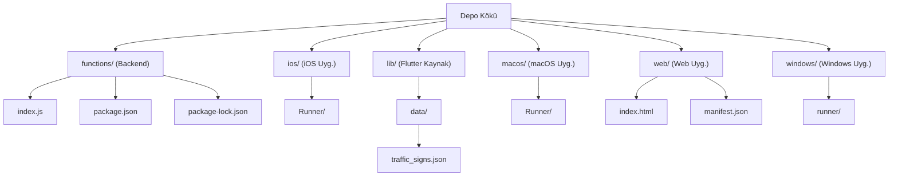

# Ehliyet Pratik AI

Bu proje, ehliyet sınavına hazırlanan sürücü adayları için tasarlanmış, yapay zeka destekli bir eğitim uygulamasıdır. Kullanıcıların sınav performanslarını analiz eder, kişiselleştirilmiş çalışma planları sunar ve trafik kuralları, ilk yardım, araç tekniği gibi konularda anlık sohbet desteği sağlar. Uygulama, Flutter ile geliştirilmiş bir mobil/web/masaüstü arayüze ve Firebase Cloud Functions üzerinde çalışan güçlü bir yapay zeka arka ucuna sahiptir.

## İçindekiler
* [Özet](#özet)
* [Özellikler](#özellikler)
* [Gereksinimler](#gereksinimler)
* [Kurulum ve çalıştırma](#kurulum-ve-çalıştırma)
* [Yapılandırma](#yapılandırma)
* [Kullanılan teknolojiler](#kullanılan-teknolojiler)
* [Mimari ve klasör yapısı](#mimari-ve-klasör-yapısı)
* [API veya uç noktalar](#api-veya-uç-noktalar)
* [Test ve kalite](#test-ve-kalite)
* [Dağıtım ve üretim notları](#dağıtım-ve-üretim-notları)
* [Katkıda bulunma](#katkıda-bulunma)
* [Lisans](#lisans)

## Özet
Ehliyet Pratik AI, ehliyet sınavına hazırlanan adaylar için akıllı bir eğitim platformu sunar. Uygulama, kullanıcıların deneme sınavı sonuçlarını Google Gemini AI kullanarak analiz eder ve kişiselleştirilmiş geri bildirimler ile iyileştirme önerileri sağlar. Ayrıca, trafik kuralları, trafik işaretleri, ilk yardım ve araç tekniği gibi konularda interaktif bir yapay zeka sohbet botu (koçu) aracılığıyla anlık destek sunar. Flutter tabanlı arayüzü sayesinde iOS, Android, Web, macOS ve Windows gibi çeşitli platformlarda sorunsuz bir deneyim sunarken, arka ucunda Firebase Cloud Functions ve Firestore kullanarak ölçeklenebilirlik ve veri yönetimi sağlar.

## Özellikler
*   **Akıllı Sınav Analizi**: Kullanıcıların tamamladığı ehliyet deneme sınavlarının sonuçlarını analiz ederek güçlü ve zayıf yönlerini belirler.
*   **Kişiselleştirilmiş Geri Bildirim**: Google Gemini AI entegrasyonu sayesinde kişiselleştirilmiş özet, iyileştirme önerileri ve motivasyonel geri bildirimler sunar.
*   **Yapay Zeka Destekli Trafik Koçu**: Ehliyet sınavı, trafik kuralları, trafik işaretleri, ilk yardım ve araç tekniği konularındaki soruları yanıtlayan interaktif bir sohbet botu mevcuttur.
*   **Sınav Sorusu Getirme**: Belirli tarihlerdeki veya kategorilerdeki sınav sorularını getirip açıklayabilir.
*   **Kapsamlı Trafik İşaretleri Veritabanı**: Türk Karayolları Genel Müdürlüğü'nün trafik işaretlerini içeren bir veri seti ile işaretlerin anlamlarını ve açıklamalarını kolayca öğrenme imkanı.
*   **Çoklu Platform Desteği**: Flutter altyapısı sayesinde iOS, Android, Web, macOS ve Windows platformlarında kullanılabilir.
*   **Sunucusuz Arka Uç**: Firebase Cloud Functions ile ölçeklenebilir ve yönetimi kolay bir arka uç mimarisi.
*   **NoSQL Veritabanı**: Google Cloud Firestore kullanarak sınav soruları ve uygulama istatistiklerinin depolanması.
*   **Dinamik Soru Yönetimi**: Cloud Functions üzerinden Firestore'dan soru çekme ve kategori bazlı rastgele soru sunma yeteneği.
*   **Güvenli API Erişimi**: Google Gemini API anahtarının Firebase Functions yapılandırması üzerinden güvenli bir şekilde yönetilmesi.

## Gereksinimler
Uygulamayı yerel ortamda çalıştırmak için aşağıdaki gereksinimler bulunmaktaktadır:

*   **Flutter SDK**: En güncel stabil sürüm önerilir.
*   **Firebase CLI**: `npm install -g firebase-tools` komutu ile yüklenebilir.
*   **Node.js**: Sürüm `22` (Firebase Functions için).
*   **npm**: Node.js ile birlikte gelen paket yöneticisi.
*   **Git**: Projeyi klonlamak için.
*   **Firebase Projesi**: Firestore ve Cloud Functions servislerinin etkinleştirildiği bir Firebase projesi.
*   **Google Gemini API Anahtarı**: Google AI Studio'dan edinilmesi gereken bir anahtar.

## Kurulum ve çalıştırma
Bu projeyi yerel ortamınızda kurmak ve çalıştırmak için aşağıdaki adımları takip edin:

### 1. Önkoşullar
*   **Flutter SDK**: [Flutter resmi web sitesinden](https://flutter.dev/docs/get-started/install) yükleyin.
*   **Firebase CLI**: `npm install -g firebase-tools` komutu ile yükleyin.
*   **Node.js ve npm**: Firebase Functions için gereklidir. [Node.js resmi web sitesinden](https://nodejs.org/en/download/) yükleyin.
*   **Git**: Projeyi klonlamak için gereklidir.

### 2. Projeyi Klonlayın
```bash
git clone <proje-depo-adresi>
cd ehliyet-pratik-ai # veya proje klasörünüzün adı
```

### 3. Firebase Projesi Kurulumu
1.  **Yeni Bir Firebase Projesi Oluşturun**: [Firebase Konsolu'na](https://console.firebase.google.com/) gidin ve yeni bir proje oluşturun.
2.  **Firebase CLI ile Giriş Yapın**:
    ```bash
    firebase login
    ```
3.  **Firebase Projesini Başlatın**: Proje kök dizininde aşağıdaki komutu çalıştırın ve Cloud Functions ile Firestore özelliklerini etkinleştirin:
    ```bash
    firebase init
    ```
    *   `Functions` ve `Firestore` seçeneklerini seçtiğinizden emin olun.
    *   Mevcut Firebase projenizi seçin.
    *   Gerekli dosya oluşturma sorularına onay verin (`functions` klasörü içinde `package.json` vs. varsa `N` diyebilirsiniz).
4.  **Firestore Veritabanını Ayarlayın**:
    *   Firebase Konsolu'nda Firestore'a gidin.
    *   `sorular` adında bir koleksiyon oluşturun. Cloud Functions backend'i, ehliyet sorularını bu koleksiyondan çeker. Her bir soru dokümanı şu alanları içermelidir:
        *   `yıl` (number)
        *   `ay` (string/number - örn: "Temmuz" veya 7)
        *   `gün` (number)
        *   `kategori` (string - örn: "Trafik ve Çevre Bilgisi")
        *   `soruMetni` (string)
        *   `secenekler` (array of strings, örn: `["Şık A", "Şık B"]`)
        *   `correctIndex` (number, doğru şıkkın 0 tabanlı indeksi)
    *   Bu koleksiyonu örnek verilerle doldurmanız gerekecektir.

### 4. Google Gemini API Anahtarını Yapılandırın
Cloud Functions, Google Gemini API'ye erişmek için bir API anahtarı gerektirir. Bu anahtarı Firebase Functions yapılandırmasına eklemeniz gerekir:

1.  **Google AI Studio'dan API Anahtarı Edinin**: [Google AI Studio](https://aistudio.google.com/) adresinden yeni bir Gemini API anahtarı oluşturun.
2.  **API Anahtarını Firebase'e Ekleyin**:
    ```bash
    firebase functions:config:set gemini.key="YOUR_GEMINI_API_KEY"
    ```
    `YOUR_GEMINI_API_KEY` yerine kendi edindiğiniz anahtarı yapıştırın.

### 5. Firebase Cloud Functions'ı Dağıtın
1.  `functions` dizinine gidin:
    ```bash
    cd functions
    ```
2.  Node.js bağımlılıklarını yükleyin:
    ```bash
    npm install
    ```
3.  Fonksiyonları Firebase'e dağıtın:
    ```bash
    firebase deploy --only functions
    ```
    Bu işlem tamamlandığında `analyzeExam` ve `trafficCoachChat` adında iki adet HTTP tetiklemeli fonksiyonunuz Firebase üzerinde çalışır durumda olacaktır.

### 6. Flutter Uygulamasını Çalıştırma
Proje kök dizinine geri dönün:

```bash
cd ..
```

1.  Flutter bağımlılıklarını yükleyin:
    ```bash
    flutter pub get
    ```
2.  Uygulamayı tercih ettiğiniz platformda çalıştırın:

    *   **Web için**:
        ```bash
        flutter run -d web
        ```
    *   **Android için**: Bir Android emülatörü veya fiziksel cihaz bağlı olduğundan emin olun.
        ```bash
        flutter run
        ```
    *   **iOS için**: Bir iOS simülatörü veya fiziksel cihaz bağlı olduğundan emin olun ve Xcode kurulumu yapın.
        ```bash
        flutter run
        ```
    *   **Windows için**:
        ```bash
        flutter run -d windows
        ```
    *   **macOS için**:
        ```bash
        flutter run -d macos
        ```

Uygulama başarıyla başlatıldığında, ehliyet sınavı hazırlık sürecinize yapay zeka destekli bir asistanla başlayabilirsiniz!

## Yapılandırma
Uygulama, temel olarak Firebase projesi ve Google Gemini API anahtarı üzerinden yapılandırılır.

| Değişken | Açıklama | Zorunlu |
|---|---|---|
| `Firebase Proje Kimliği` | Firebase konsolunda oluşturulan projenin benzersiz kimliği. Functions ve Firestore bağlantısı için gereklidir. | Evet |
| `GEMINI_API_KEY` | Google Gemini API'ye erişim için kullanılan API anahtarı. Firebase Functions ortam değişkeni olarak ayarlanır. | Evet |
| `Firestore Koleksiyonu` | Ehliyet sorularını içeren Firestore koleksiyonunun adı (`sorular`). | Evet |

## Kullanılan teknolojiler
Bu proje, modern ve ölçeklenebilir teknolojileri bir araya getirerek geliştirilmiştir:

*   **Frontend**:
    *   **Flutter**: Google'ın UI araç kiti ile hızlı ve esnek mobil, web ve masaüstü uygulamaları geliştirme.
    *   **Dart**: Flutter uygulamalarının temel programlama dili.
*   **Backend**:
    *   **Firebase Cloud Functions (Node.js)**: Sunucusuz mimari ile ölçeklenebilir arka uç mantığı sağlar.
        *   `Node.js`: 22
        *   `firebase-admin`: ^12.6.0
        *   `firebase-functions`: ^6.0.1
        *   `@google/generative-ai`: ^0.24.1
    *   **Google Gemini API**: Yapay zeka destekli içerik üretimi ve analiz için kullanılır (sınav analizi ve sohbet).
    *   **Firebase Admin SDK**: Firestore veritabanı ve diğer Firebase servisleri ile etkileşim için kullanılır.
*   **Veritabanı**:
    *   **Google Cloud Firestore**: Sınav soruları ve uygulama istatistikleri gibi dinamik verileri depolamak için kullanılan NoSQL bulut veritabanı.
*   **Altyapı ve Dağıtım**:
    *   **Firebase**: Kimlik doğrulama, veritabanı, sunucusuz işlevler ve hosting gibi birçok hizmeti sunar.

## Mimari ve klasör yapısı
Projenin temel klasör yapısı, çoklu platform desteği sağlayan bir Flutter uygulaması ile sunucusuz bir Firebase arka ucunu bir araya getirir. `lib/` dizini Flutter uygulamasının ana Dart kaynak kodlarını barındırırken, `functions/` dizini Firebase Cloud Functions için Node.js kodlarını içerir. `ios/`, `macos/`, `web/` ve `windows/` gibi platforma özgü klasörler, Flutter'ın çoklu platform yeteneklerini destekleyen yapılandırma ve başlatma dosyalarını tutar. `lib/data/traffic_signs.json` gibi statik veri dosyaları, uygulamanın zengin içerik sunmasına olanak tanır.

| Bölüm / klasör | Kısa açıklama |
|---|---|
| `functions/` | Firebase Cloud Functions (Backend) kaynak kodları. |
| `functions/index.js` | Ana Cloud Functions mantığı, AI ve Firestore entegrasyonu. |
| `functions/package.json` | Functions için Node.js bağımlılıkları ve script'ler. |
| `functions/package-lock.json` | Functions bağımlılıklarının kilit dosyası. |
| `ios/` | Flutter iOS uygulamasına özel dosyalar. |
| `ios/Runner/` | iOS uygulama başlatma ve varlık dosyaları. |
| `ios/Runner/Assets.xcassets/AppIcon.appiconset/Contents.json` | iOS uygulama ikon yapılandırması. |
| `ios/Runner/Assets.xcassets/LaunchImage.imageset/Contents.json` | iOS açılış ekranı görsel yapılandırması. |
| `ios/Runner/Assets.xcassets/LaunchImage.imageset/README.md` | iOS açılış ekranı varlıklarının özelleştirme talimatları. |
| `lib/` | Flutter uygulamasının Dart kaynak kodları (Frontend). |
| `lib/data/` | Statik veri dosyalarını içeren klasör. |
| `lib/data/traffic_signs.json` | Trafik işaretlerinin statik veri dosyası. |
| `macos/` | Flutter macOS uygulamasına özel dosyalar. |
| `macos/Runner/` | macOS uygulama başlatma ve varlık dosyaları. |
| `macos/Runner/Assets.xcassets/AppIcon.appiconset/Contents.json` | macOS uygulama ikon yapılandırması. |
| `web/` | Flutter web uygulamasına özel dosyalar. |
| `web/index.html` | Web uygulamasının ana HTML dosyası. |
| `web/manifest.json` | Web uygulama manifest dosyası. |
| `windows/` | Flutter Windows uygulamasına özel dosyalar. |
| `windows/runner/` | Windows masaüstü uygulamasının C++ başlatma ve pencere yönetimi kodları. |
| `windows/runner/flutter_window.cpp` | Flutter pencere yöneticisi ve plugin kayıt kodu. |
| `windows/runner/main.cpp` | Windows uygulamasının ana giriş noktası. |
| `windows/runner/utils.cpp` | Yardımcı fonksiyonlar (konsol ve komut satırı argümanları). |
| `windows/runner/win32_window.cpp` | Win32 pencere yönetimi için temel sınıf. |
| `README.md` | Proje açıklaması ve dokümantasyon dosyası. |



## API veya uç noktalar
Firebase Cloud Functions üzerinde iki ana HTTP tetiklemeli API uç noktası bulunmaktadır:

*   **`/analyzeExam` (POST)**:
    *   Kullanıcıların tamamladığı bir ehliyet deneme sınavının sonuçlarını (doğru/yanlış cevaplar, konu bazlı performans) içeren bir JSON listesi bekler.
    *   Google Gemini AI kullanarak sınav performansını analiz eder ve kullanıcının güçlü/zayıf yönleri, çalışma önerileri ve motivasyonel geri bildirimler içeren kişiselleştirilmiş bir özet döndürür.
*   **`/trafficCoachChat` (POST)**:
    *   Kullanıcılardan ehliyet sınavı, trafik kuralları, ilk yardım veya araç tekniği gibi konularda bir soru metni (`question`) bekler.
    *   Ayrıca, isteğe bağlı olarak o anki sınav sorusunun veya bir sınavdaki soru listesinin bağlamını alabilir.
    *   Google Gemini AI'yı kullanarak kullanıcının sorusuna uygun, öğretici ve bilgilendirici bir yanıt üretir. Veritabanından belirli tarihli veya kategorili soruları da çekebilir.

## Test ve kalite
Bu depoda tanımlanmış özel test scriptleri bulunmamaktadır. Ancak `functions/package.json` dosyasında `firebase-functions-test` bağımlılığı mevcuttur, bu da Cloud Functions için birim testleri yazılabileceğini göstermektedir.

Önerilen test ve kalite iyileştirmeleri:
*   **Birim Testleri**: Firebase Cloud Functions için `firebase-functions-test` kullanarak `analyzeExam` ve `trafficCoachChat` gibi fonksiyonların işlevselliğini doğrulamak.
*   **Entegrasyon Testleri**: Flutter uygulamasının Cloud Functions ile doğru şekilde etkileşim kurduğunu test etmek.
*   **UI Testleri**: Flutter'ın widget testleri ve entegrasyon testleri ile kullanıcı arayüzünün ve akışların doğru çalıştığını kontrol etmek.
*   **Linting/Biçimlendirme**: Dart için `dart analyze` ve JavaScript/TypeScript için ESLint gibi araçlar kullanarak kod kalitesi ve tutarlılığını sağlamak.

## Dağıtım ve üretim notları
Proje, Firebase platformu üzerinde dağıtım için tasarlanmıştır. `functions` dizinindeki Node.js tabanlı arka uç, Firebase Cloud Functions olarak dağıtılır. `firebase deploy --only functions` komutu, arka uç fonksiyonlarını Firebase'e yüklemek için kullanılır. Flutter uygulaması ise çeşitli platformlara (Web, iOS, Android, macOS, Windows) derlenerek dağıtılabilir. Firebase Hosting, web uygulamasının sunulması için kullanılabilir. Üretim ortamında, API anahtarları gibi hassas bilgilerin Firebase Functions ortam değişkenleri veya Secret Manager kullanılarak güvenli bir şekilde yönetildiğinden emin olunmalıdır.

## Katkıda bulunma
Bu projeye katkıda bulunmak isterseniz, lütfen bir `issue` açarak önerilerinizi belirtin veya mevcut sorunlara çözüm getiren bir `pull request` gönderin. Katkılarınız memnuniyetle karşılanır.

## Lisans
Lisans dosyası belirtilmemiştir; `LICENSE` eklenmesi önerilir.