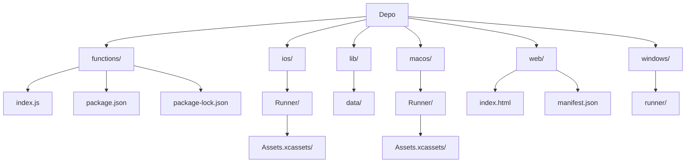

# Ehliyet Pratik AI

Bu proje, ehliyet sınavına hazırlanan sürücü adayları için tasarlanmış, yapay zeka destekli bir eğitim uygulamasıdır. Kullanıcıların sınav performanslarını analiz eder, kişiselleştirilmiş çalışma planları sunar ve trafik kuralları, ilk yardım, araç tekniği gibi konularda anlık sohbet desteği sağlar. Uygulama, Flutter ile geliştirilmiş bir mobil/web/masaüstü arayüze ve Firebase Cloud Functions üzerinde çalışan güçlü bir yapay zeka arka ucuna sahiptir.

## İçindekiler
* [Özet](#özet)
* [Özellikler](#özellikler)
* [Gereksinimler](#gereksinimler)
* [Kurulum ve çalıştırma](#kurulum-ve-çalıştırma)
* [Yapılandırma](#yapılandırma)
* [Kullanılan teknolojiler](#kullanılan-teknolojiler)
* [Mimari ve klasör yapısı](#mimari-ve-klasör-yapısı)
* [API veya uç noktalar](#api-veya-uç-noktalar)
* [Test ve kalite](#test-ve-kalite)
* [Dağıtım ve üretim notları](#dağıtım-ve-üretim-notları)
* [Katkıda bulunma](#katkıda-bulunma)
* [Lisans](#lisans)

## Özet
Ehliyet Pratik AI, ehliyet sınavına hazırlanan sürücü adaylarına yönelik yenilikçi bir yapay zeka destekli eğitim platformudur. Uygulama, kullanıcıların deneme sınavı sonuçlarını detaylı bir şekilde analiz eder, güçlü ve zayıf yönlerini belirleyerek kişiselleştirilmiş çalışma önerileri sunar. Google Gemini AI entegrasyonu sayesinde trafik kuralları, ilk yardım ve araç tekniği gibi konularda anlık interaktif sohbet desteği sağlar. Flutter ile geliştirilen uygulama, iOS, Android, Web, macOS ve Windows gibi çeşitli platformlarda sorunsuz bir deneyim sunarken, arka uç işlevleri Firebase Cloud Functions ve Google Cloud Firestore üzerinde çalışır.

## Özellikler
*   **Akıllı Sınav Analizi**: Kullanıcıların ehliyet deneme sınavı sonuçlarını (doğru/yanlış cevaplar, konu bazlı performans) Google Gemini AI kullanarak analiz eder.
*   **Kişiselleştirilmiş Geri Bildirimler**: Analiz sonuçlarına göre kişiselleştirilmiş özetler, iyileştirme önerileri ve motivasyonel mesajlar sunar.
*   **Yapay Zeka Destekli Trafik Koçu**: Ehliyet sınavı, trafik kuralları, trafik işaretleri, ilk yardım ve araç tekniği gibi konularda interaktif chatbot desteği sağlar.
*   **Sınav Sorusu Getirme**: Belirli tarihlerdeki veya kategorilerdeki sınav sorularını getirip yapay zeka desteğiyle açıklayabilir.
*   **Kapsamlı Trafik İşaretleri Veritabanı**: Türk Karayolları Genel Müdürlüğü'nün trafik işaretlerini içeren statik bir veri seti içerir.
*   **Çoklu Platform Uyumluluğu**: Flutter sayesinde iOS, Android, Web, macOS ve Windows platformlarında tek bir kod tabanıyla çalışır.
*   **Sunucusuz Arka Uç**: Firebase Cloud Functions kullanarak ölçeklenebilir ve yönetimi kolay bir arka uç altyapısı sunar.
*   **Esnek Veri Depolama**: Sınav soruları ve uygulama istatistikleri için Google Cloud Firestore NoSQL veritabanını kullanır.
*   **Kolay Kurulum**: Firebase CLI ve Flutter komutları ile yerel geliştirme ortamında hızlıca kurulabilir.
*   **Modüler Yapı**: Frontend (Flutter/Dart) ve Backend (Node.js/Firebase Functions) ayrı modüller halinde geliştirilmiştir.

## Gereksinimler
Uygulamayı yerel ortamda çalıştırmak veya geliştirmek için aşağıdaki bileşenlere ihtiyaç duyulur:

*   **Node.js**: Sürüm 22 veya üzeri (Firebase Cloud Functions için).
*   **npm**: Node.js ile birlikte gelir.
*   **Flutter SDK**: Flutter uygulamalarını derlemek ve çalıştırmak için.
*   **Firebase CLI**: Firebase projelerini yönetmek, fonksiyonları dağıtmak ve emülatörleri başlatmak için.
*   **Git**: Proje deposunu klonlamak için.
*   **Firebase Projesi**: Cloud Functions ve Firestore servisleri etkinleştirilmiş bir Firebase projesi.
*   **Google Gemini API Anahtarı**: Yapay zeka entegrasyonu için.

## Kurulum ve çalıştırma
Projeyi yerel ortamınızda kurmak ve çalıştırmak için aşağıdaki adımları takip edin:

### 1. Önkoşulları Yükleyin
*   **Flutter SDK**: [Flutter resmi web sitesinden](https://flutter.dev/docs/get-started/install) yükleyin.
*   **Firebase CLI**: Komut satırından `npm install -g firebase-tools` ile yükleyin.
*   **Node.js ve npm**: [Node.js resmi web sitesinden](https://nodejs.org/en/download/) yükleyin. Node.js 22 sürümü önerilir.
*   **Git**: Git sürüm kontrol sistemini yükleyin.

### 2. Projeyi Klonlayın
Depoyu yerel ortamınıza klonlayın ve proje dizinine geçin:
```bash
git clone <proje-depo-adresi> # Depo adresini güncelleyin
cd ehliyet-pratik-ai # veya klonladığınız klasörün adı
```

### 3. Firebase Projesi Kurulumu
1.  **Yeni Bir Firebase Projesi Oluşturun**: [Firebase Konsolu'na](https://console.firebase.google.com/) gidin ve yeni bir proje oluşturun.
2.  **Firebase CLI ile Giriş Yapın**:
    ```bash
    firebase login
    ```
3.  **Firebase Projesini Başlatın**: Proje kök dizininde aşağıdaki komutu çalıştırın ve `Functions` ile `Firestore` özelliklerini etkinleştirin:
    ```bash
    firebase init
    ```
    *   İstenirse mevcut Firebase projenizi seçin.
    *   `functions` klasörü içinde `package.json` gibi dosyalar zaten varsa dosya oluşturma sorularına onay vermeyebilirsiniz (`N`).
4.  **Firestore Veritabanını Ayarlayın**:
    *   Firebase Konsolu'nda Firestore bölümüne gidin.
    *   `sorular` adında bir koleksiyon oluşturun. Cloud Functions, ehliyet sorularını bu koleksiyondan çeker. Her bir soru dokümanı en az aşağıdaki alanları içermelidir:
        *   `yıl` (sayı)
        *   `ay` (metin/sayı, örn: "Temmuz" veya 7)
        *   `gün` (sayı)
        *   `kategori` (metin, örn: "Trafik ve Çevre Bilgisi")
        *   `soruMetni` (metin)
        *   `secenekler` (metin dizisi, örn: `["Şık A", "Şık B"]`)
        *   `correctIndex` (sayı, doğru şıkkın 0 tabanlı indeksi)
    *   Bu koleksiyonu örnek verilerle doldurmanız gerekecektir.

### 4. Google Gemini API Anahtarını Yapılandırın
Cloud Functions, Google Gemini API'ye erişmek için bir API anahtarı gerektirir. Bu anahtarı Firebase Functions yapılandırmasına eklemeniz gerekir:
1.  **Google AI Studio'dan API Anahtarı Edinin**: [Google AI Studio](https://aistudio.google.com/) adresinden yeni bir Gemini API anahtarı oluşturun.
2.  **API Anahtarını Firebase'e Ekleyin**:
    ```bash
    firebase functions:config:set gemini.key="YOUR_GEMINI_API_KEY"
    ```
    `YOUR_GEMINI_API_KEY` yerine kendi edindiğiniz anahtarı yapıştırın.

### 5. Firebase Cloud Functions'ı Dağıtın
1.  `functions` dizinine gidin:
    ```bash
    cd functions
    ```
2.  Node.js bağımlılıklarını yükleyin:
    ```bash
    npm install
    ```
3.  Fonksiyonları Firebase'e dağıtın:
    ```bash
    firebase deploy --only functions
    ```
    Bu işlem tamamlandığında `analyzeExam` ve `trafficCoachChat` adında iki adet HTTP tetiklemeli fonksiyonunuz Firebase üzerinde çalışır durumda olacaktır.

### 6. Flutter Uygulamasını Çalıştırma
Proje kök dizinine geri dönün:
```bash
cd ..
```
1.  Flutter bağımlılıklarını yükleyin:
    ```bash
    flutter pub get
    ```
2.  Uygulamayı tercih ettiğiniz platformda çalıştırın:
    *   **Web için**: `flutter run -d web`
    *   **Android için**: Bir Android emülatörü veya fiziksel cihaz bağlı olduğundan emin olun. `flutter run`
    *   **iOS için**: Bir iOS simülatörü veya fiziksel cihaz bağlı olduğundan emin olun ve Xcode kurulumu yapın. `flutter run`
    *   **Windows için**: `flutter run -d windows`
    *   **macOS için**: `flutter run -d macos`

Uygulama başarıyla başlatıldığında, ehliyet sınavı hazırlık sürecinize yapay zeka destekli bir asistanla başlayabilirsiniz!

## Yapılandırma
Bu proje, hassas bilgileri doğrudan kaynak kodunda tutmak yerine Firebase Functions yapılandırmasını (veya yerel geliştirme için ortam değişkenlerini) kullanır.

| Değişken | Açıklama | Zorunlu |
|---|---|---|
| `gemini.key` | Google Gemini API erişim anahtarı. Yapay zeka destekli analiz ve sohbet işlevleri için gereklidir. Bu, `firebase functions:config:set` ile ayarlanır. | Evet |

## Kullanılan teknolojiler
Bu proje aşağıdaki temel teknolojileri kullanmaktadır:

*   **Frontend**:
    *   **Flutter**: Çapraz platform UI geliştirme araç kiti.
    *   **Dart**: Flutter uygulamalarının temel programlama dili.
*   **Backend**:
    *   **Firebase Cloud Functions**: Sunucusuz arka uç hizmetleri (Node.js ortamında).
    *   **Node.js**: Firebase Functions çalışma zamanı.
    *   **Google Gemini API**: Yapay zeka destekli içerik üretimi ve analizi.
    *   **Firebase Admin SDK**: Firebase hizmetleriyle güvenli arka uç etkileşimi.
*   **Veritabanı**:
    *   **Google Cloud Firestore**: Sınav verileri ve istatistikler için NoSQL bulut veritabanı.
*   **Backend Bağımlılıkları (Node.js)**:
    *   `@google/generative-ai`: Google Gemini API entegrasyonu için.
    *   `firebase-admin`: Firebase Admin SDK.
    *   `firebase-functions`: Firebase Functions SDK.

## Mimari ve klasör yapısı
Proje, Flutter'ın çoklu platform yeteneklerini Firebase'in sunucusuz arka uç hizmetleriyle birleştiren modern bir mimariye sahiptir. `lib/` klasörü altında Flutter uygulamasının Dart kaynak kodları yer alırken, `functions/` klasörü Firebase Cloud Functions için Node.js kodlarını barındırır. Bu ayrım, hem ön ucun hem de arka ucun bağımsız olarak geliştirilmesine ve ölçeklenmesine olanak tanır. Her platforma özel (iOS, Android, Web, macOS, Windows) yapılandırma ve derleme dosyaları ilgili klasörlerde tutulur.

Aşağıda projenin ana klasör yapısı ve kısa açıklamaları bulunmaktadır:

| Bölüm / klasör | Kısa açıklama |
|---|---|
| `README.md` | Proje hakkında genel bilgi, kurulum ve kullanım talimatları. |
| `functions/` | Firebase Cloud Functions için Node.js arka uç kodları. |
| `functions/index.js` | Ana Cloud Functions mantığı, AI ve Firestore entegrasyonu. |
| `functions/package.json` | Functions için Node.js bağımlılıkları ve script'leri. |
| `functions/package-lock.json` | Functions bağımlılıklarının kilit dosyası. |
| `ios/` | Flutter iOS uygulamasına özel dosyalar ve ayarlar. |
| `ios/Runner/` | iOS uygulamasının ana çalışma dizini. |
| `ios/Runner/Assets.xcassets/` | iOS uygulama ikonları ve açılış ekranı görselleri. |
| `lib/` | Flutter uygulamasının Dart kaynak kodları (Frontend). |
| `lib/data/` | Uygulama içinde kullanılan statik veri dosyaları. |
| `lib/data/traffic_signs.json` | Trafik işaretlerinin verilerini içeren JSON dosyası. |
| `macos/` | Flutter macOS uygulamasına özel dosyalar ve ayarlar. |
| `macos/Runner/` | macOS uygulamasının ana çalışma dizini. |
| `macos/Runner/Assets.xcassets/` | macOS uygulama ikonları. |
| `web/` | Flutter web uygulamasına özel dosyalar ve ayarlar. |
| `web/index.html` | Web uygulamasının ana HTML dosyası. |
| `web/manifest.json` | Web uygulama manifest dosyası. |
| `windows/` | Flutter Windows uygulamasına özel dosyalar ve ayarlar. |
| `windows/runner/` | Windows masaüstü uygulamasının C++ başlatma ve pencere yönetimi kodları. |



## API veya uç noktalar
Projenin arka ucunda, Firebase Cloud Functions tarafından sağlanan iki ana HTTP uç noktası bulunmaktadır:

*   **`/analyzeExam` (POST)**: Kullanıcı tarafından tamamlanan bir ehliyet deneme sınavının sonuçlarını (doğru/yanlış cevaplar, konu bazlı performans) içeren bir JSON nesnesi alır. Bu veriyi Google Gemini AI kullanarak analiz eder ve kullanıcının zayıf/güçlü yönlerini, kişiselleştirilmiş çalışma önerilerini ve motive edici bir geri bildirimi içeren bir JSON yanıtı döndürür.
*   **`/trafficCoachChat` (POST)**: Kullanıcının ehliyet sınavı, trafik kuralları, trafik işaretleri, ilk yardım ve araç tekniği gibi konulardaki sorularını içeren bir metin alır. Firebase Firestore'dan ilgili sınav sorularını veya genel bilgileri çekerek ve Google Gemini AI'ı kullanarak kullanıcının sorusuna yönelik eğitici ve açıklayıcı bir yanıt (düz metin formatında) döndürür. Ayrıca, küfür/hakaret filtrelemesi de içerir.

## Test ve kalite
Bu depoda doğrudan bir test script'i (`npm test` gibi) belirtilmemiştir. Ancak `functions/package.json` dosyasında `firebase-functions-test` bir geliştirme bağımlılığı olarak listelenmiştir, bu da Firebase Cloud Functions için birim testlerinin yazılabileceğini göstermektedir.

Geliştirme sürecinde aşağıdaki test ve kalite komutlarının eklenmesi önerilir:
*   **Birim Testleri**: Firebase Functions için `firebase-functions-test` kullanılarak fonksiyonların doğru çalıştığını doğrulamak.
*   **Entegrasyon Testleri**: Flutter uygulaması ile Firebase Functions arasındaki iletişimin ve veri akışının test edilmesi.
*   **Linting/Biçimlendirme**: Dart ve JavaScript/Node.js kod kalitesini sağlamak için linting ve otomatik biçimlendirme araçları (ör. `dart format .`, `eslint`) kullanılabilir.

## Dağıtım ve üretim notları
Firebase Cloud Functions, `firebase deploy --only functions` komutu ile Firebase ortamına kolayca dağıtılır. Flutter uygulaması ise `flutter build` komutlarıyla ilgili platformlar (Web, Android, iOS, Windows, macOS) için ayrı ayrı derlenebilir. Android ve iOS için uygulama mağazası dağıtımı (Google Play Store, Apple App Store) standart Flutter ve platforma özgü adımları takip eder. Web uygulaması Firebase Hosting gibi bir hizmete dağıtılabilir. Masaüstü uygulamaları (Windows, macOS) ise derlendikten sonra ilgili platformların dağıtım yöntemleri kullanılarak kullanıcılara ulaştırılır. Üretim ortamında Firebase yapılandırma ve API anahtarlarının güvenli bir şekilde yönetildiğinden emin olunmalıdır.

## Katkıda bulunma
Projeye katkıda bulunmak isterseniz, lütfen bir `issue` açarak önerinizi belirtin veya doğrudan `pull request` gönderin. Her türlü katkı memnuniyetle karşılanır. Kodlama standartlarına uyum ve açık commit mesajları tercih edilir.

## Lisans
Lisans dosyası belirtilmemiştir; `LICENSE` dosyasının eklenmesi önerilir.